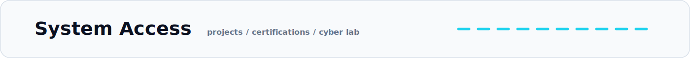
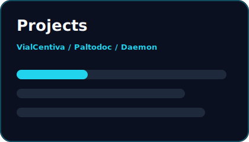
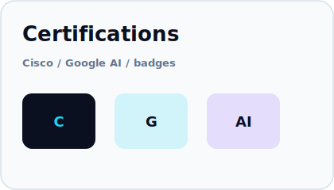
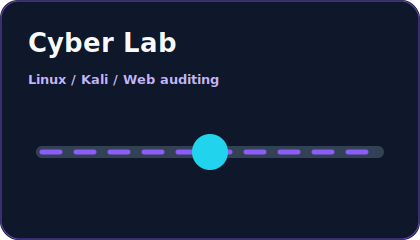
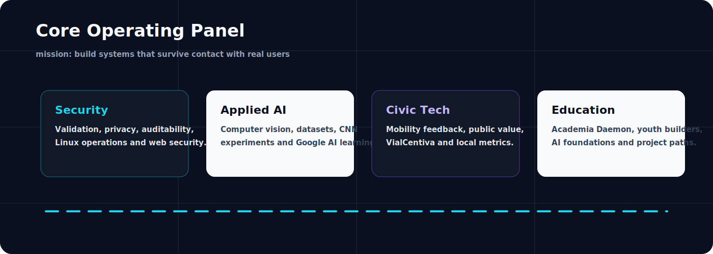
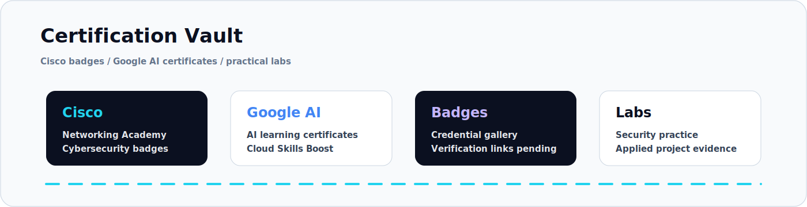
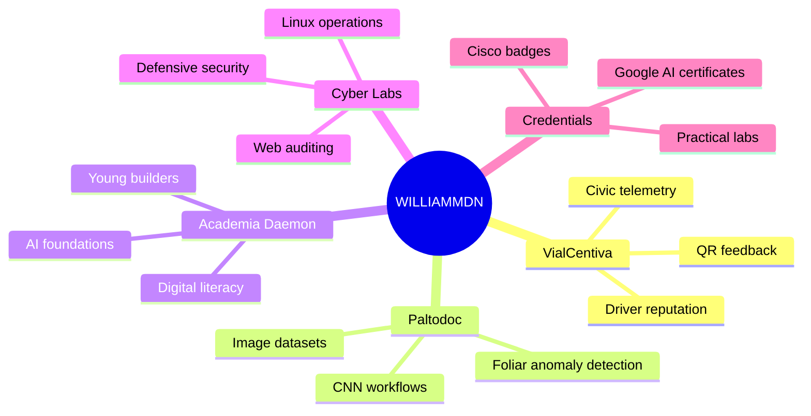

<p align="center">
  
</p>

<p align="center">
  <a href="https://github.com/WILLIAMMDN?tab=followers"></a>
  <a href="https://github.com/WILLIAMMDN?tab=repositories"></a>
  <a href="https://www.linkedin.com/in/max-william-medina-castro-b73421216/"></a>
  
</p>

<p align="center">
  <a href="https://github.com/WILLIAMMDN">
    
  </a>
</p>

<p align="center">
  
</p>

<p align="center">
  
</p>

<p align="center">
  <a href="docs/PROJECTS.md"></a>
  <a href="docs/CERTIFICATIONS.md"></a>
  <a href="docs/SECURITY-LAB.md"></a>
</p>

<p align="center">
  
</p>

## System Profile

```javascript
const WilliamMedina = {
  location: "Apurimac, Peru",
  role: ["Systems Engineering", "Cybersecurity", "Applied AI"],
  currentSystems: ["VialCentiva", "Paltodoc", "Academia Daemon", "Cyber Labs"],
  focus: {
    security: ["Linux", "Kali", "Burp Suite", "Bash", "secure routines"],
    web: ["React", "Vite", "Supabase", "PHP", "MySQL"],
    ai: ["Python", "CNN workflows", "image datasets", "Google AI learning"],
    hardware: ["Arduino", "ESP32", "monitoring prototypes"]
  },
  principle: "Build useful systems with evidence, privacy and public value."
};
```

<p align="center">
  
</p>

## Current Operations

<table>
  <tr>
    <td width="25%" align="center"><strong>VialCentiva</strong></td>
    <td>QR-based mobility trust platform for passenger feedback, driver reputation and civic transport metrics.</td>
  </tr>
  <tr>
    <td width="25%" align="center"><strong>Paltodoc</strong></td>
    <td>Applied AI workflow for foliar anomaly detection with image datasets and CNN experimentation.</td>
  </tr>
  <tr>
    <td width="25%" align="center"><strong>Academia Daemon</strong></td>
    <td>Digital literacy and AI foundations for young builders, with project-based learning paths.</td>
  </tr>
  <tr>
    <td width="25%" align="center"><strong>Cyber Labs</strong></td>
    <td>Controlled security practice: Linux operations, web auditing, scripting and defensive habits.</td>
  </tr>
</table>

## Technology Stack

<p align="center">
  <a href="https://skillicons.dev">
    
  </a>
</p>

<table align="center">
  <tr>
    <td align="center" width="96"><br>Python</td>
    <td align="center" width="96"><br>JavaScript</td>
    <td align="center" width="96"><br>React</td>
    <td align="center" width="96"><br>Supabase</td>
    <td align="center" width="96"><br>Linux</td>
    <td align="center" width="96"><br>Bash</td>
  </tr>
</table>

<p align="center">
  
</p>

## Certifications And Badges

<p align="center">
  
  
  
  
</p>

> Credential gallery and verification links are organized in [docs/CERTIFICATIONS.md](docs/CERTIFICATIONS.md). When I publish each certificate image or badge URL, this section becomes a full public proof wall.

<p align="center">
  
</p>

## Contribution Snake

<p align="center">
  <picture>
    <source media="(prefers-color-scheme: dark)" srcset="https://raw.githubusercontent.com/WILLIAMMDN/WILLIAMMDN/output/github-contribution-grid-snake-dark.svg" />
    <source media="(prefers-color-scheme: light)" srcset="https://raw.githubusercontent.com/WILLIAMMDN/WILLIAMMDN/output/github-contribution-grid-snake.svg" />
    
  </picture>
</p>

<details open>
<summary><h2>GitHub Telemetry</h2></summary>

<p align="center">
  
</p>

<p align="center">
  
  
</p>

<p align="center">
  
  
</p>

</details>

<details>
<summary><h2>Project Radar</h2></summary>



</details>

## Contact Channel

<p align="center">
  <a href="https://www.linkedin.com/in/max-william-medina-castro-b73421216/"></a>
  <a href="https://github.com/WILLIAMMDN"></a>
</p>

<p align="center">
  
</p>
