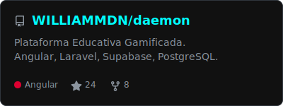
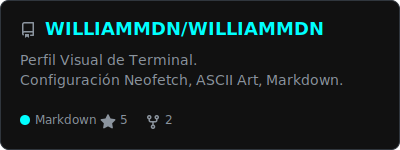
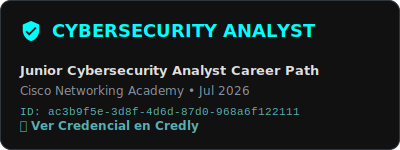
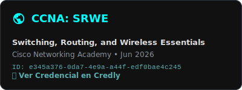
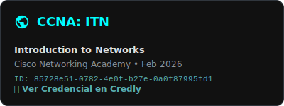
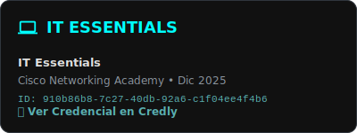

  <picture>
    <source media="(prefers-color-scheme: dark)" srcset="./assets/profile/intro-dark.svg" />
    <source media="(prefers-color-scheme: light)" srcset="./assets/profile/intro-light.svg" />
    
  </picture>

<h1 align="center">William Medina</h1>

  <strong>Estudiante de Ingeniería de Sistemas</strong> metido en desarrollo web, ciberseguridad e IA aplicada.
  Me gusta crear cosas que no se queden solo en una demo bonita: proyectos que alguien pueda usar, probar y mejorar.

  
  
  
  

## Sobre mí

Soy de los que aprende mejor construyendo. A veces eso significa pelearme con una integración, ordenar una base de datos, mejorar una pantalla en móvil o romper algo en un laboratorio controlado para entender cómo protegerlo mejor.

Ahora estoy enfocado en:

- **Aplicaciones web reales:** Angular, React, Firebase, Supabase, Laravel y APIs.
- **Ciberseguridad defensiva:** Linux, Kali, auditoría web y buenas prácticas de desarrollo seguro.
- **IA aplicada:** proyectos con datos, visión por computadora y herramientas que resuelvan problemas concretos.
- **Tecnología con impacto local:** transporte, educación, agricultura y comunidades que necesitan soluciones simples y útiles.

## Stack que uso y estoy fortaleciendo

  

## Proyectos que me representan

### CamisetaPromo2025
Plataforma para la Promoción 2025 de la IEE José María Arguedas: registro de camisetas, tallas, agenda, deportes, comunidad, fotos, comentarios y panel admin con Firebase.

### VialCentiva
Sistema de reputación para transporte mediante QR, pensado para que los pasajeros puedan evaluar y consultar información útil de conductores.

### Paltodoc
Proyecto de IA para apoyar la detección de anomalías foliares en palta, trabajando con imágenes, datasets y flujos de evaluación.

### Academia Daemon
Iniciativa educativa para acercar programación, IA y cultura digital a niños y adolescentes con proyectos prácticos.

### Cyber Labs
Mi espacio de práctica para ciberseguridad defensiva, Linux, Bash, auditoría web y aprendizaje técnico controlado.

  <a href="docs/PROJECTS.md">Ver mapa completo de proyectos</a> ·
  <a href="docs/SECURITY-LAB.md">Ver laboratorio de seguridad</a> ·
  <a href="archive/historical-work-log/README.md">Ver archivo histórico</a>

## 💻 Sistema y Entorno (Cyber Labs)

  

## 🐍 Contribuciones de GitHub

  <picture>
    <source media="(prefers-color-scheme: dark)" srcset="https://raw.githubusercontent.com/WILLIAMMDN/WILLIAMMDN/output/github-contribution-grid-snake-dark.svg" />
    <source media="(prefers-color-scheme: light)" srcset="https://raw.githubusercontent.com/WILLIAMMDN/WILLIAMMDN/output/github-contribution-grid-snake.svg" />
    
  </picture>

## 📊 Repositorios Destacados

  
  &nbsp;
  

## 💻 Tech Stack Principal

  

  
📈 Gráfico de Actividad Extendida

   
  

    <picture>
      <source media="(prefers-color-scheme: dark)" srcset="https://github-readme-activity-graph.vercel.app/graph?username=WILLIAMMDN&bg_color=111111&color=e0e0e0&line=00ffff&point=5ab0b2&area=true&hide_border=true" />
      <source media="(prefers-color-scheme: light)" srcset="https://github-readme-activity-graph.vercel.app/graph?username=WILLIAMMDN&bg_color=ffffff&color=334155&line=0f766e&point=2563eb&area=true&hide_border=true" />
      
    </picture>
  

## 🏆 Licencias y Certificaciones Profesionales

  
  &nbsp;
  

  
  &nbsp;
  

 

  
  
  

---

  <a href="docs/PROJECTS.md">Proyectos</a> ·
  <a href="docs/CERTIFICATIONS.md">Certificados</a> ·
  <a href="docs/SECURITY-LAB.md">Security Lab</a> ·
  <a href="docs/GITHUB-ACHIEVEMENTS.md">Logros</a>

