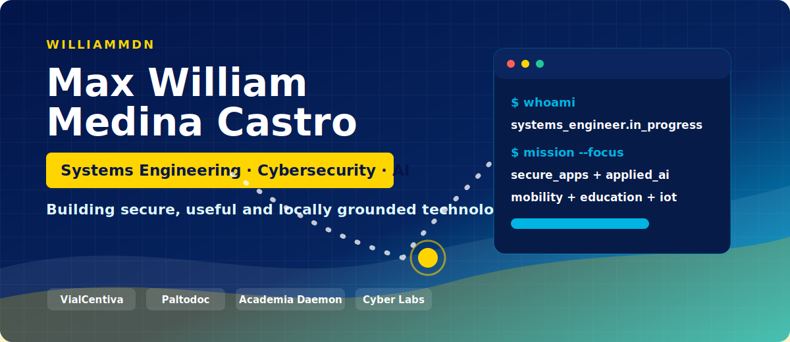
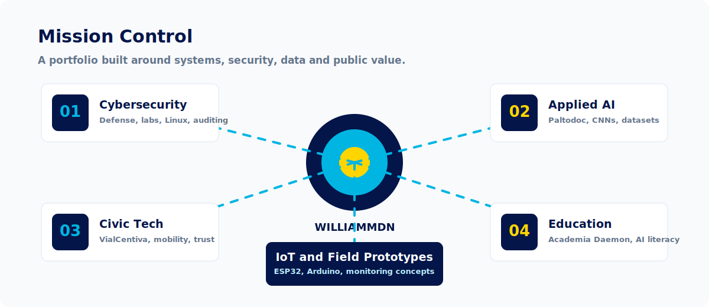
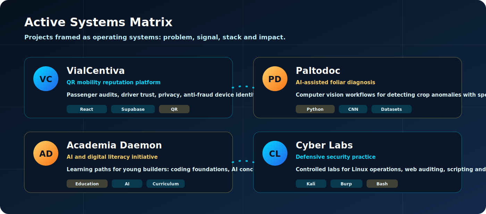
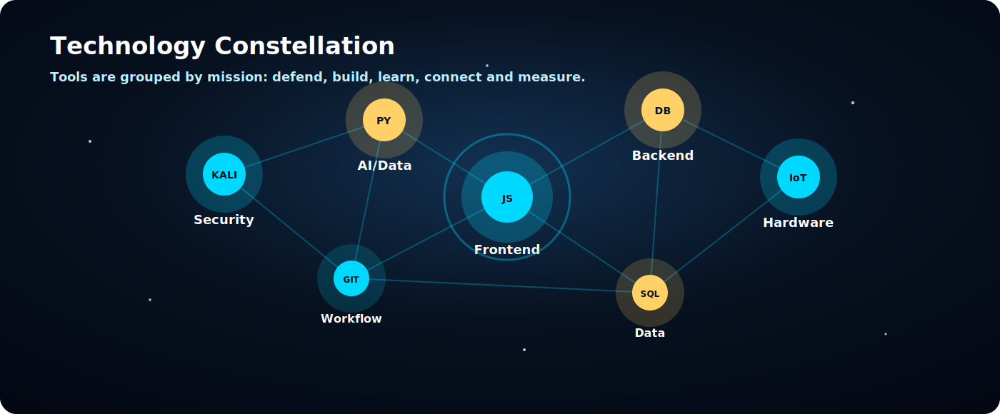
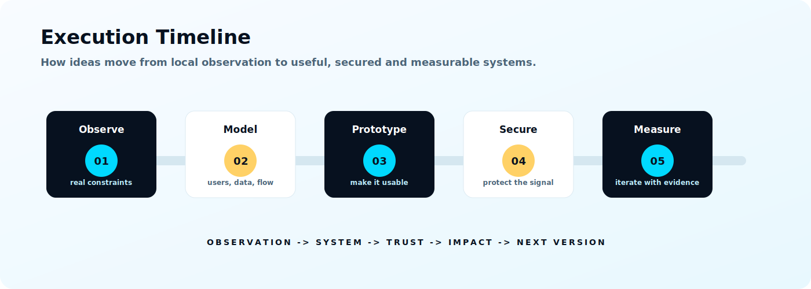
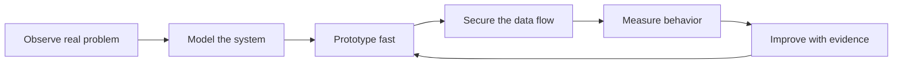
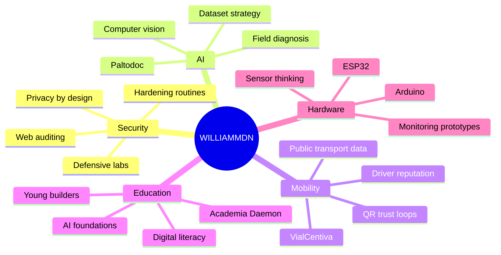
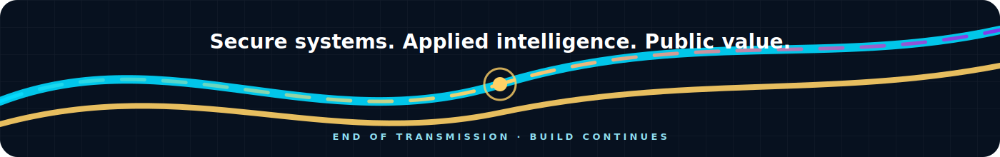

  

  
  
  
  

  

  

## Identity Kernel

I am Max William Medina Castro, a Systems Engineering student building a portfolio around security, applied AI, civic technology and field-ready prototypes. My work is not just about shipping screens; it is about designing trust loops: who generates data, who can see it, how it is protected and what decision it improves.

<table>
  <tr>
    <td width="33%">
      <strong>Security mindset</strong> 
      I treat authentication, privacy, validation and observability as architecture, not decoration.
    </td>
    <td width="33%">
      <strong>Applied intelligence</strong> 
      I use AI where it touches reality: diagnosis, learning, classification, monitoring and decision support.
    </td>
    <td width="33%">
      <strong>Local impact</strong> 
      I build for problems close to the ground: transport, agriculture, education and digital inclusion.
    </td>
  </tr>
</table>

  

## Active Systems

  

<table>
  <tr>
    <th align="left">System</th>
    <th align="left">Purpose</th>
    <th align="left">Technical focus</th>
  </tr>
  <tr>
    <td><strong>VialCentiva</strong></td>
    <td>Passenger QR platform for public transport reputation, safer trips and local incentive loops.</td>
    <td>React, Supabase, QR flows, privacy, antifraud device identity, civic telemetry.</td>
  </tr>
  <tr>
    <td><strong>Paltodoc</strong></td>
    <td>AI-assisted foliar anomaly detection for avocado crops using specialized datasets.</td>
    <td>Python, CNN workflows, dataset preparation, visual diagnosis, model evaluation.</td>
  </tr>
  <tr>
    <td><strong>Academia Daemon</strong></td>
    <td>Digital literacy and AI fundamentals for children and teenagers.</td>
    <td>Learning systems, curriculum design, coding foundations, responsible AI introduction.</td>
  </tr>
  <tr>
    <td><strong>Cyber Labs</strong></td>
    <td>Controlled practice environment for defensive security, auditing and hardening habits.</td>
    <td>Kali, Linux, Burp Suite, Bash, web security, secure development routines.</td>
  </tr>
</table>

## Technology Constellation

  

  

  
  
  
  
  
  

## Execution Timeline

  

## GitHub Telemetry

  

  
  

  
  

  

## Operating Principles

<table>
  <tr>
    <td width="25%"><strong>Prototype visibly</strong> Every system should show progress fast enough to be questioned, tested and improved.</td>
    <td width="25%"><strong>Protect the user</strong> Data collection only matters when privacy, consent and access rules are respected.</td>
    <td width="25%"><strong>Document the path</strong> A project is stronger when another builder can understand why each decision exists.</td>
    <td width="25%"><strong>Build for context</strong> Technology becomes powerful when it fits the place, people and constraints around it.</td>
  </tr>
</table>

## Radar Map

## Contact Channel

  
  

  

  <strong>Building from Apurimac with discipline, security thinking and production intent.</strong>

