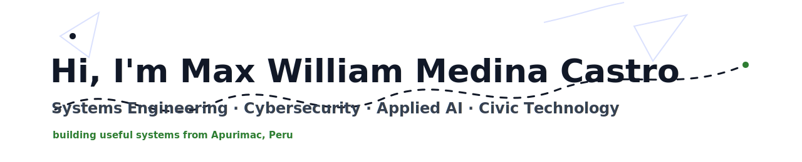

&nbsp;&nbsp;&nbsp;&nbsp;

&nbsp;&nbsp;&nbsp;&nbsp;

&nbsp;&nbsp;&nbsp;&nbsp;

&nbsp;&nbsp;&nbsp;&nbsp;

Welcome to my GitHub profile. I am <strong>Max William Medina Castro</strong>, a Systems Engineering student focused on cybersecurity, applied AI, web systems and technology with local impact. I like building projects that can be used in real contexts: transport reputation systems, agricultural AI workflows, digital literacy initiatives and controlled security labs.

My work is currently centered on <strong>VialCentiva</strong>, <strong>Paltodoc</strong>, <strong>Academia Daemon</strong> and my own cybersecurity practice environment. I care about clean architecture, useful interfaces, documented decisions, privacy and learning by building.

## My favorite tools and technologies

> Tools and technologies that I use, study or apply in current projects.

<table>
  <tr>
    <td align="center" width="96">
      
       Python
    </td>
    <td align="center" width="96">
      
       JavaScript
    </td>
    <td align="center" width="96">
      
       React
    </td>
    <td align="center" width="96">
      
       Vite
    </td>
    <td align="center" width="96">
      
       Supabase
    </td>
    <td align="center" width="96">
      
       PHP
    </td>
    <td align="center" width="96">
      
       MySQL
    </td>
    <td align="center" width="96">
      
       GitHub
    </td>
  </tr>
  <tr>
    <td align="center" width="96">
      
       Kali
    </td>
    <td align="center" width="96">
      
       Linux
    </td>
    <td align="center" width="96">
      
       Bash
    </td>
    <td align="center" width="96">
      
       Git
    </td>
    <td align="center" width="96">
      
       C
    </td>
    <td align="center" width="96">
      
       Arduino
    </td>
    <td align="center" width="96">
      
       Postman
    </td>
    <td align="center" width="96">
      
       Google AI
    </td>
  </tr>
</table>

## Current work

| Project | Focus | Stack / Area |
| --- | --- | --- |
| **VialCentiva** | QR-based passenger evaluations, driver reputation and transport transparency. | React, Supabase, civic UX |
| **Paltodoc** | Foliar anomaly detection for avocado crops. | Python, CNN workflows, datasets |
| **Academia Daemon** | Digital literacy and AI fundamentals for children and teenagers. | Education, AI, coding |
| **Cyber Labs** | Defensive security practice and controlled web auditing. | Kali, Linux, Burp Suite, Bash |

## Historical work archive

I started using GitHub as my main public portfolio after already working on these projects. This archive migrates that previous work into a dated, reviewable technical log.

[Open historical work log](archive/historical-work-log/README.md) | [Open command activity log](archive/command-activity-log/README.md) | [GitHub achievements roadmap](docs/GITHUB-ACHIEVEMENTS.md)

## William in motion

  

  VialCentiva, Paltodoc, Academia Daemon and Cyber Labs in one route.

## Certifications and badges

  
  
  
  

More details: [Certification registry](docs/CERTIFICATIONS.md).

## GitHub stats

  
GitHub Profile Stats

   
  
  

  
Activity Graph

   

  
Contribution Snake

   
  

    <picture>
      <source media="(prefers-color-scheme: dark)" srcset="https://raw.githubusercontent.com/WILLIAMMDN/WILLIAMMDN/output/github-contribution-grid-snake-dark.svg" />
      <source media="(prefers-color-scheme: light)" srcset="https://raw.githubusercontent.com/WILLIAMMDN/WILLIAMMDN/output/github-contribution-grid-snake.svg" />
      
    </picture>
  

  
GitHub Profile Trophy

   
  

    
  

## Recent GitHub activity

  <a href="docs/PROJECTS.md">Projects</a> |
  <a href="docs/CERTIFICATIONS.md">Certifications</a> |
  <a href="docs/SECURITY-LAB.md">Security Lab</a> |
  <a href="docs/GITHUB-ACHIEVEMENTS.md">Achievements</a> |
  <a href="archive/historical-work-log/README.md">Historical Log</a> |
  <a href="archive/command-activity-log/README.md">Command Log</a>

