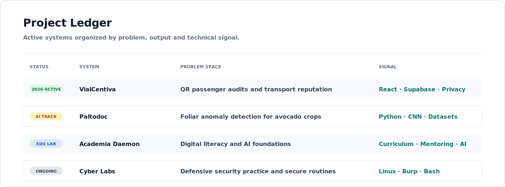
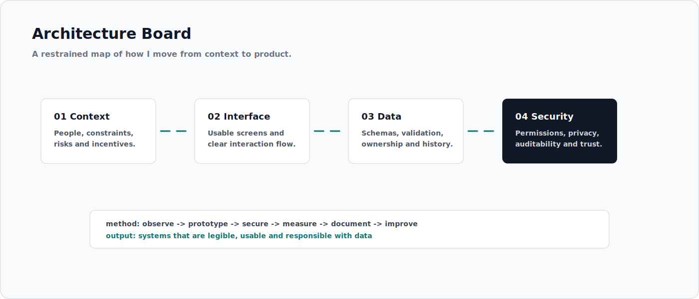
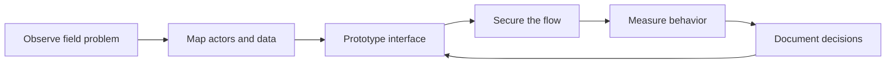
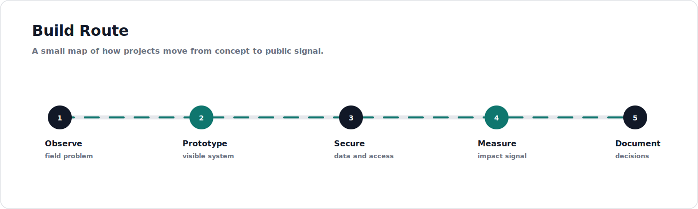

  

  
  
  
  

  

  

## Operating Dossier

I build systems where software has to meet real constraints: public transport, education, agriculture, security practice and field-ready prototypes. My focus is not to make demos look busy, but to design products that can be understood, tested, documented and improved.

<table>
  <tr>
    <td width="33%"><strong>Security as structure</strong> Privacy, validation, permissions and traceability are part of the product architecture.</td>
    <td width="33%"><strong>AI with a use case</strong> Computer vision, datasets and automation should improve decisions, not just decorate a pitch.</td>
    <td width="33%"><strong>Local impact</strong> Transport, education and agriculture deserve the same engineering care as enterprise software.</td>
  </tr>
</table>

  

## Systems In Progress

<table>
  <tr>
    <th align="left">System</th>
    <th align="left">Problem space</th>
    <th align="left">Current engineering angle</th>
  </tr>
  <tr>
    <td><strong>VialCentiva</strong></td>
    <td>Passenger trust, public transport reputation and QR-based trip feedback.</td>
    <td>React, Supabase, privacy flow, device identity, metrics and civic UX.</td>
  </tr>
  <tr>
    <td><strong>Paltodoc</strong></td>
    <td>Foliar anomaly detection for avocado crops.</td>
    <td>Python, image datasets, CNN experiments and model evaluation.</td>
  </tr>
  <tr>
    <td><strong>Academia Daemon</strong></td>
    <td>Digital literacy and AI foundations for young builders.</td>
    <td>Curriculum, guided projects, coding foundations and applied learning.</td>
  </tr>
  <tr>
    <td><strong>Cyber Labs</strong></td>
    <td>Defensive security practice in controlled environments.</td>
    <td>Linux, Kali, Burp Suite, Bash, web auditing and secure routines.</td>
  </tr>
</table>

## Architecture Map

  

## Technical Index

  

<table>
  <tr>
    <td width="25%"><strong>Security</strong> Kali Linux, Burp Suite, Bash, hardening, controlled labs.</td>
    <td width="25%"><strong>Web systems</strong> React, Vite, JavaScript, PHP, Supabase, MySQL.</td>
    <td width="25%"><strong>AI and data</strong> Python, CNN workflows, image datasets, evaluation loops.</td>
    <td width="25%"><strong>Hardware</strong> Arduino, ESP32, sensor thinking, monitoring prototypes.</td>
  </tr>
</table>

## Build Route

  

## Contribution Route

  <picture>
    <source media="(prefers-color-scheme: dark)" srcset="https://raw.githubusercontent.com/WILLIAMMDN/WILLIAMMDN/output/github-contribution-grid-snake-dark.svg" />
    <source media="(prefers-color-scheme: light)" srcset="https://raw.githubusercontent.com/WILLIAMMDN/WILLIAMMDN/output/github-contribution-grid-snake.svg" />
    
  </picture>

## GitHub Telemetry

  
  

  

## Principles

<table>
  <tr>
    <td width="25%"><strong>Make it legible</strong> If a system cannot be explained, it cannot be improved.</td>
    <td width="25%"><strong>Prototype with intent</strong> Fast iterations are useful when they answer real questions.</td>
    <td width="25%"><strong>Respect the data</strong> Every field collected should have a reason, an owner and a boundary.</td>
    <td width="25%"><strong>Keep building</strong> The best portfolio is a trail of shipped, revised and documented systems.</td>
  </tr>
</table>

## Contact

  
  

  

