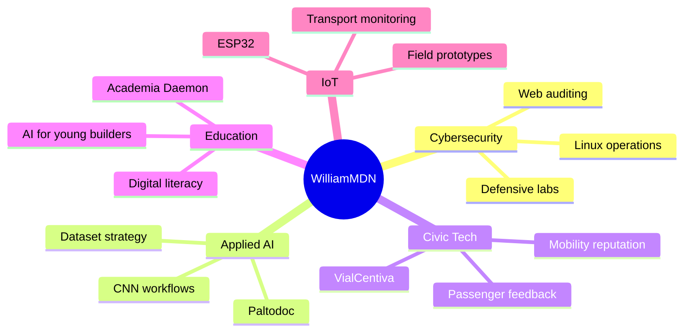

  

<h1 align="center">Max William Medina Castro</h1>

  <strong>Systems Engineering | Cybersecurity | Applied AI | IoT | Civic Technology</strong>

  
  
  
  

  

  

## Technical Identity

I build systems where software, data and people meet: secure platforms, AI-assisted diagnosis, mobility intelligence, digital literacy programs and connected prototypes. My current work is centered on practical engineering: interfaces that people can use, data flows that can be trusted and products that solve visible problems.

<table>
  <tr>
    <td width="50%">
      <strong>Core direction</strong> 
      Defensive cybersecurity, full-stack systems, AI workflows, IoT experiments and civic technology for local impact.
    </td>
    <td width="50%">
      <strong>Operating style</strong> 
      I prefer useful products over abstract demos: observable, documented, deployable and ready to be improved in public.
    </td>
  </tr>
</table>

  

## Current Systems

<table>
  <tr>
    <td width="25%" align="center"><strong>VialCentiva</strong></td>
    <td>
      Passenger-facing mobility platform for QR-based trip evaluations, driver reputation, public transport transparency and local incentive loops.
    </td>
  </tr>
  <tr>
    <td width="25%" align="center"><strong>Paltodoc</strong></td>
    <td>
      Applied AI project focused on foliar anomaly detection using specialized datasets and convolutional neural network workflows.
    </td>
  </tr>
  <tr>
    <td width="25%" align="center"><strong>Academia Daemon</strong></td>
    <td>
      Digital literacy and AI fundamentals initiative for children and adolescents, designed to reduce the gap between curiosity and creation.
    </td>
  </tr>
  <tr>
    <td width="25%" align="center"><strong>Cyber Labs</strong></td>
    <td>
      Defensive security practice with Linux environments, controlled labs, web security tooling, scripting and hardening habits.
    </td>
  </tr>
</table>

## Engineering Stack

  

  
  
  
  
  
  

<table>
  <tr>
    <th align="left">Domain</th>
    <th align="left">Tools and practices</th>
  </tr>
  <tr>
    <td><strong>Cybersecurity</strong></td>
    <td>Linux, Kali, Burp Suite, Bash, defensive auditing, controlled labs, secure thinking</td>
  </tr>
  <tr>
    <td><strong>Web systems</strong></td>
    <td>React, Vite, JavaScript, PHP, Supabase, MySQL, REST-oriented integration</td>
  </tr>
  <tr>
    <td><strong>AI and data</strong></td>
    <td>Python, CNN workflows, dataset preparation, evaluation loops, applied prototypes</td>
  </tr>
  <tr>
    <td><strong>IoT</strong></td>
    <td>Arduino, ESP32, sensor thinking, transport monitoring concepts and field-oriented prototypes</td>
  </tr>
</table>

## GitHub Telemetry

  

  
  

  
  

  

## Build Philosophy

<table>
  <tr>
    <td width="33%">
      <strong>Security is a design layer</strong> 
      Authentication, privacy, RLS, logs and validation are not final touches. They are product structure.
    </td>
    <td width="33%">
      <strong>AI must touch reality</strong> 
      Models matter when they help people decide, diagnose, learn or act with better information.
    </td>
    <td width="33%">
      <strong>Local problems deserve serious engineering</strong> 
      Transport, education and agriculture can be treated with the same rigor as enterprise software.
    </td>
  </tr>
</table>

## Project Radar

## Contact

  
  

  

  <strong>Building from Apurimac with discipline, curiosity and production intent.</strong>

